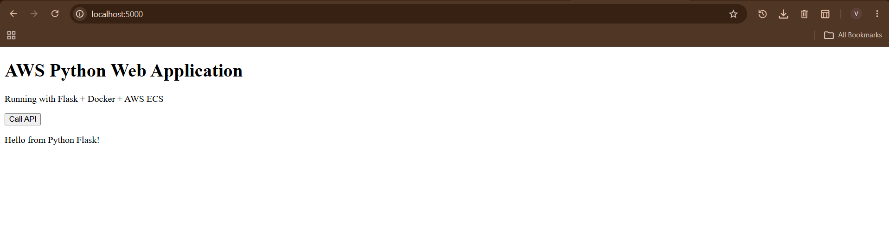
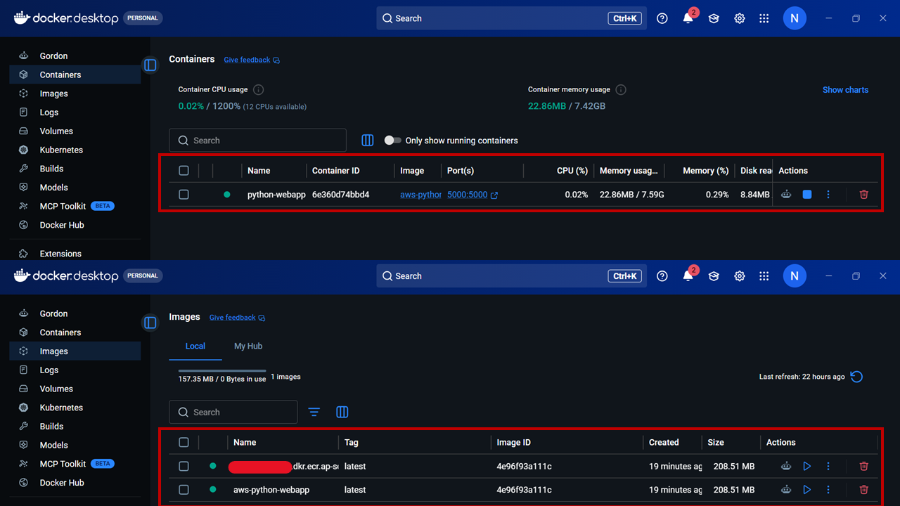
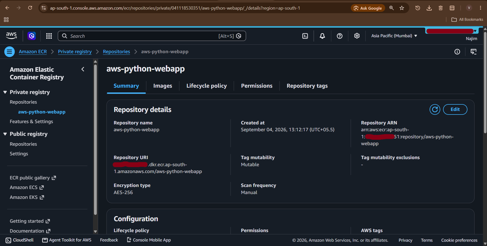
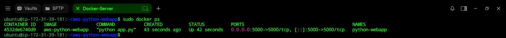
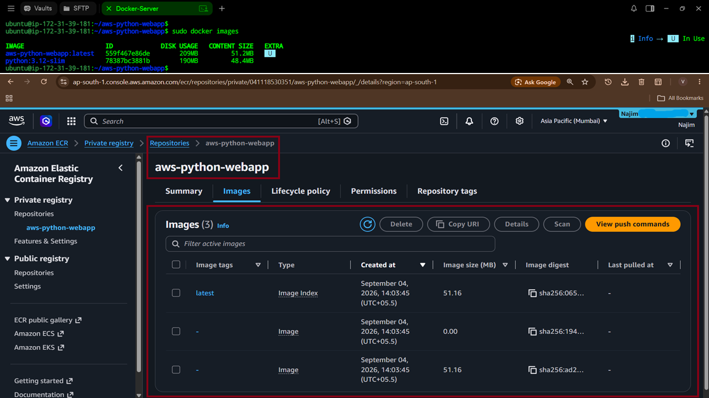
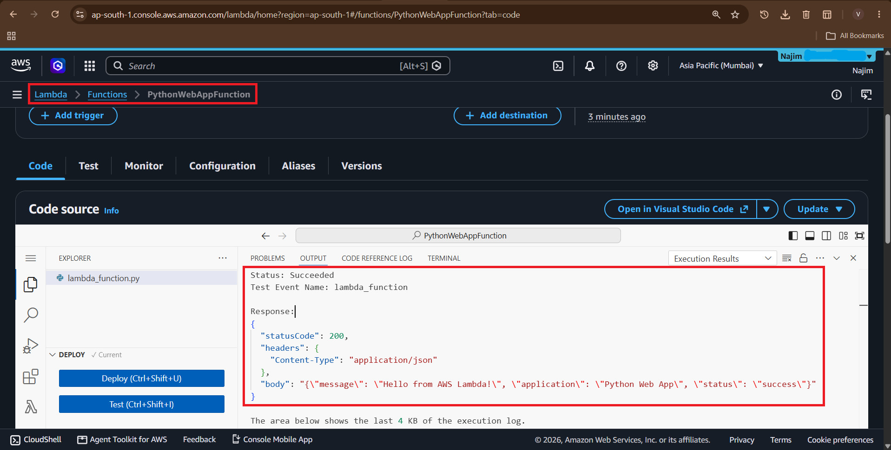
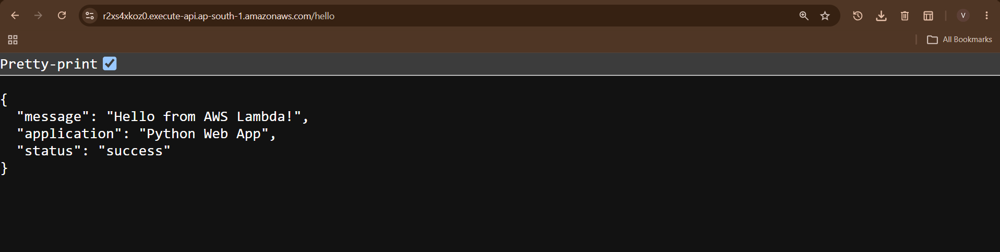
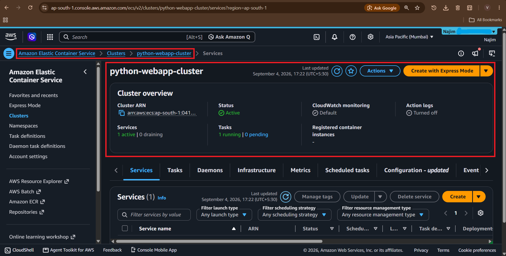
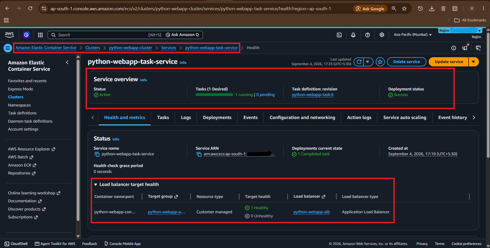
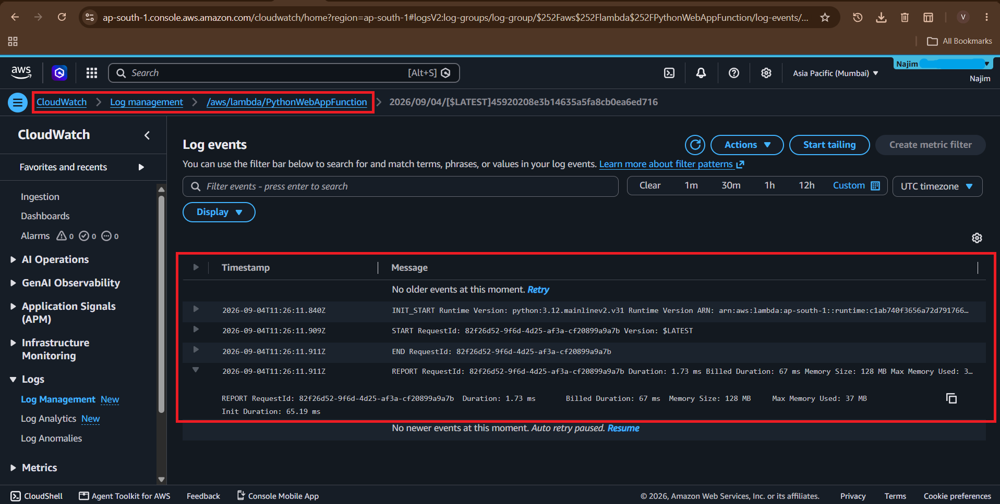

# 🚀 AWS Python Web Application

A practical cloud deployment project demonstrating how to build, containerize, and deploy a **Python Flask web application** using **Docker and multiple AWS services** including Amazon EC2, Amazon ECR, Amazon ECS/Fargate, AWS Lambda, API Gateway, IAM, and CloudWatch.

The project demonstrates both **container-based deployment** and a separate **serverless deployment path**.

---

## 📌 Project Overview

This project starts with a simple Python Flask web application and progressively deploys it using different AWS services.

### Deployment paths

**Containerized application:**

```text
Python Flask
     ↓
Docker
     ↓
Amazon ECR
     ↓
Amazon ECS / Fargate
     ↓
Application
```

**EC2 deployment:**

```text
Python Flask
     ↓
Docker
     ↓
Amazon ECR
     ↓
Amazon EC2
     ↓
Docker Container
```

**Serverless API:**

```text
Client
   ↓
API Gateway
   ↓
AWS Lambda
   ↓
Python Function
   ↓
CloudWatch
```

---

## 🏗️ Architecture

```text
                           ┌──────────────────┐
                           │     Internet     │
                           └────────┬─────────┘
                                    │
                   ┌────────────────┴────────────────┐
                   │                                 │
                   ▼                                 ▼
          ┌─────────────────┐               ┌─────────────────┐
          │   ECS Fargate   │               │   API Gateway   │
          └────────┬────────┘               └────────┬────────┘
                   │                                 │
                   ▼                                 ▼
          ┌─────────────────┐               ┌─────────────────┐
          │ Docker Container│               │     Lambda      │
          │  Python Flask   │               │  Python Function│
          └────────┬────────┘               └────────┬────────┘
                   │                                 │
                   │                                 ▼
                   │                         ┌─────────────────┐
                   │                         │   CloudWatch    │
                   │                         │      Logs       │
                   │                         └─────────────────┘
                   │
                   ▼
          ┌─────────────────┐
          │  Amazon ECR     │
          │ Docker Registry │
          └────────┬────────┘
                   │
                   ▼
          ┌─────────────────┐
          │   Amazon EC2    │
          │  Docker Server  │
          └─────────────────┘
```

The project documentation describes ECS/Fargate, ECR, EC2, Lambda, API Gateway, and CloudWatch as the major deployment components. 
---

## 🎯 Objectives

The main objectives of this project are:

- Build a Python Flask web application
- Run the application locally
- Containerize the application using Docker
- Create an Amazon ECR repository
- Push the Docker image to ECR
- Deploy the application on Amazon EC2
- Pull and run the ECR image on EC2
- Create an AWS Lambda function using Python
- Integrate Lambda with API Gateway
- Deploy the Docker application using ECS/Fargate
- Monitor application/serverless activity using CloudWatch
- Understand the basic AWS container deployment workflow

---

## 🛠️ Technologies Used

| Technology | Purpose |
|---|---|
| Python 3.12 | Application development |
| Flask | Web framework |
| HTML5 | Frontend |
| Docker | Containerization |
| Amazon ECR | Docker image registry |
| Amazon EC2 | Virtual server / Docker host |
| Amazon ECS | Container orchestration |
| AWS Fargate | Serverless container execution |
| AWS Lambda | Serverless Python execution |
| API Gateway | HTTP API endpoint |
| IAM | AWS permissions |
| CloudWatch | Logs and monitoring |
| Git | Version control |
| GitHub | Source code hosting |

The application uses Flask 3.1.2 and Python 3.12 in the documented implementation. 
---

# 📁 Project Structure

```text
aws-python-webapp/
│
├── app.py
├── lambda_function.py
├── requirements.txt
├── Dockerfile
├── .gitignore
├── README.md
│
├── templates/
│   └── index.html
│
├── aws/
│   ├── lambda/
│   │   └── lambda_function.py
│   │
│   ├── ecs/
│   │   └── task-definition.json
│   │
│   └── commands/
│       └── deployment-commands.md
│
├── screenshots/
│   ├── 01-local-application.png
│   ├── 02-docker-container.png
│   ├── 03-ecr-repository.png
│   ├── 04-ec2-docker.png
│   ├── 05-ecr-image-on-ec2.png
│   ├── 06-lambda-function.png
│   ├── 07-api-gateway.png
│   ├── 08-ecs-cluster.png
│   ├── 09-ecs-service.png
│   └── 10-cloudwatch.png
│
└── docs/
    └── project-documentation.pdf
```

---

# 🐍 Application

The Flask application provides a web interface and REST-style API endpoints.

### Available endpoints

| Endpoint | Description |
|---|---|
| `/` | Web application homepage |
| `/api/hello` | Returns a JSON greeting |
| `/api/info` | Returns application and deployment information |

Example `/api/hello` response:

```json
{
  "message": "Hello from Python Flask!",
  "status": "success"
}
```

Example `/api/info` response:

```json
{
  "application": "AWS Python Web App",
  "platform": "Docker",
  "deployment": "ECS"
}
```

These endpoints and responses are part of the documented Flask implementation.

---

# 💻 Run the Application Locally

## 1. Clone the repository

```bash
git clone https://github.com/<YOUR_USERNAME>/aws-python-webapp.git
```

```bash
cd aws-python-webapp
```

---

## 2. Create a virtual environment

### Windows

```powershell
python -m venv venv
```

```powershell
venv\Scripts\activate
```

### Linux

```bash
python3 -m venv venv
```

```bash
source venv/bin/activate
```

---

## 3. Install dependencies

```bash
pip install -r requirements.txt
```

---

## 4. Run the Flask application

```bash
python app.py
```

Open:

```text
http://localhost:5000
```

The documented local deployment uses a Python virtual environment, installs the requirements, and runs the Flask application on port 5000.

---

# 🐳 Docker Deployment

## 1. Build the Docker image

```bash
docker build -t aws-python-webapp .
```

Check the image:

```bash
docker images
```

---

## 2. Run the container

```bash
docker run -d \
  -p 5000:5000 \
  --name python-webapp \
  aws-python-webapp
```

Check the running container:

```bash
docker ps
```

Open:

```text
http://localhost:5000
```

The project Docker configuration uses Python 3.12, installs the requirements, exposes port 5000, and starts `app.py`.

---

# 📦 Amazon ECR Deployment

Amazon Elastic Container Registry (ECR) is used to store the Docker image.

## 1. Create an ECR repository

```bash
aws ecr create-repository \
  --repository-name aws-python-webapp \
  --region ap-south-1
```

---

## 2. Get the repository URI

```bash
aws ecr describe-repositories \
  --repository-names aws-python-webapp \
  --region ap-south-1
```

Example:

```text
<ACCOUNT_ID>.dkr.ecr.ap-south-1.amazonaws.com/aws-python-webapp
```

---

## 3. Authenticate Docker with ECR

```bash
aws ecr get-login-password \
  --region ap-south-1 |
docker login \
  --username AWS \
  --password-stdin \
  <ACCOUNT_ID>.dkr.ecr.ap-south-1.amazonaws.com
```

---

## 4. Tag the image

```bash
docker tag \
  aws-python-webapp:latest \
  <ACCOUNT_ID>.dkr.ecr.ap-south-1.amazonaws.com/aws-python-webapp:latest
```

---

## 5. Push the image

```bash
docker push \
  <ACCOUNT_ID>.dkr.ecr.ap-south-1.amazonaws.com/aws-python-webapp:latest
```

The documented workflow creates an ECR repository, authenticates Docker, tags the image, and pushes it to ECR.

---

# 🖥️ EC2 Deployment

An Ubuntu EC2 instance can be used as a Docker host.

## Security Group

Configure the required inbound ports:

| Port | Protocol | Purpose |
|---:|---|---|
| 22 | TCP | SSH |
| 80 | TCP | HTTP |
| 5000 | TCP | Flask application |

---

## Connect to EC2

```bash
ssh -i mykey.pem ubuntu@<EC2_PUBLIC_IP>
```

---

## Install Docker

```bash
sudo apt update
```

```bash
sudo apt install docker.io -y
```

Enable Docker:

```bash
sudo systemctl enable docker
```

Start Docker:

```bash
sudo systemctl start docker
```

Check Docker:

```bash
docker --version
```

The documented EC2 deployment uses Ubuntu and installs Docker before running the application container.

---

# 🚢 Run the Application on EC2

Clone the GitHub repository:

```bash
git clone https://github.com/<YOUR_USERNAME>/aws-python-webapp.git
```

```bash
cd aws-python-webapp
```

Build the image:

```bash
sudo docker build -t aws-python-webapp .
```

Run:

```bash
sudo docker run -d \
  -p 5000:5000 \
  --name python-webapp \
  aws-python-webapp
```

Access the application:

```text
http://<EC2_PUBLIC_IP>:5000
```

---

# 📥 Pull Docker Image from ECR to EC2

Authenticate Docker with ECR:

```bash
aws ecr get-login-password \
  --region ap-south-1 |
sudo docker login \
  --username AWS \
  --password-stdin \
  <ACCOUNT_ID>.dkr.ecr.ap-south-1.amazonaws.com
```

Pull the image:

```bash
sudo docker pull \
  <ACCOUNT_ID>.dkr.ecr.ap-south-1.amazonaws.com/aws-python-webapp:latest
```

Run the image:

```bash
sudo docker run -d \
  -p 5000:5000 \
  --name python-webapp \
  <ACCOUNT_ID>.dkr.ecr.ap-south-1.amazonaws.com/aws-python-webapp:latest
```

The documented deployment demonstrates pulling the image from ECR and running it on an EC2 Docker host.

---

# ⚡ AWS Lambda

The project also includes a serverless Python function.

### Lambda function

```text
lambda_function.py
```

The function returns:

```json
{
  "message": "Hello from AWS Lambda!",
  "application": "Python Web App",
  "status": "success"
}
```

The documented Lambda deployment uses Python 3.12 and the handler:

```text
lambda_function.lambda_handler
```


---

# 🌐 API Gateway + Lambda

The serverless architecture is:

```text
Client
  │
  ▼
API Gateway
  │
  ▼
Lambda
  │
  ▼
Python Function
```

Example API endpoint:

```text
GET /hello
```

Example response:

```json
{
  "message": "Hello from AWS Lambda!",
  "application": "Python Web App",
  "status": "success"
}
```

The project documentation uses API Gateway as the HTTP entry point to the Lambda function.

---

# ☁️ Amazon ECS / Fargate

The Docker image stored in ECR can be deployed to Amazon ECS using AWS Fargate.

### ECS architecture

```text
ECS Cluster
     │
     └── ECS Service
             │
             └── ECS Task
                    │
                    └── Docker Container
                             │
                             ▼
                            ECR
```

### Task configuration

| Setting | Value |
|---|---|
| Launch Type | Fargate |
| Task Family | `python-webapp-task` |
| Container | `python-webapp` |
| Container Port | `5000` |
| CPU | `0.5 vCPU` |
| Memory | `1 GB` |
| Image | ECR Docker image |

These values follow the ECS/Fargate configuration documented for the project.

For production-style access, an **Application Load Balancer** can be placed in front of the ECS service.

---

# 📊 CloudWatch Monitoring

Amazon CloudWatch can be used to monitor AWS workloads and view logs.

Example:

```text
AWS Lambda
    │
    ▼
CloudWatch
    │
    ▼
Log Group
    │
    ▼
Log Stream
```

The project includes CloudWatch for viewing Lambda/ECS logs.

---

# 🔐 Security Considerations

Never commit sensitive AWS information to GitHub.

### Do NOT upload:

```text
AWS Access Keys
AWS Secret Keys
.pem files
.env files
AWS credentials
Passwords
Database credentials
Private keys
```

Use placeholders in documentation:

```text
<ACCOUNT_ID>
<ECR_URI>
<EC2_PUBLIC_IP>
<API_GATEWAY_URL>
```

Example:

```text
<ACCOUNT_ID>.dkr.ecr.ap-south-1.amazonaws.com/aws-python-webapp
```

Add sensitive files to `.gitignore`:

```gitignore
.env
*.pem
.aws/
```

---

# 📸 Project Screenshots

Screenshots demonstrating the deployment can be found in the `screenshots/` directory.

### Local Application



### Docker Container



### Amazon ECR



### EC2 Docker Deployment



### ECR Image on EC2



### AWS Lambda



### API Gateway



### ECS Cluster



### ECS Service



### CloudWatch



---

# 🧪 Testing

## Test Flask application

```bash
curl http://localhost:5000/api/hello
```

Expected:

```json
{
  "message": "Hello from Python Flask!",
  "status": "success"
}
```

## Test application information

```bash
curl http://localhost:5000/api/info
```

## Test Docker container

```bash
docker ps
```

## Test EC2 deployment

Open:

```text
http://<EC2_PUBLIC_IP>:5000
```

## Test Lambda

Invoke the Lambda function from the AWS Console or through the configured API Gateway endpoint.

---

# 📚 What I Learned

Through this project, I practiced:

- Python Flask application development
- REST API basics
- Docker image creation
- Docker container management
- Amazon ECR image management
- EC2 Linux server administration
- Docker deployment on EC2
- AWS Lambda serverless computing
- API Gateway integration
- Amazon ECS concepts
- AWS Fargate deployment
- IAM permissions
- CloudWatch logging
- AWS CLI commands
- Git and GitHub project management

---

# 🎓 Skills Demonstrated

```text
Python
Flask
Linux
Docker
AWS CLI
Amazon EC2
Amazon ECR
Amazon ECS
AWS Fargate
AWS Lambda
API Gateway
IAM
CloudWatch
Git
GitHub
```

---

# 🚀 Future Improvements

Possible future enhancements include:

- Add an Application Load Balancer
- Add HTTPS using ACM
- Add Route 53 custom domain
- Implement CI/CD using GitHub Actions
- Add automated Docker image builds
- Add automated ECR deployments
- Add ECS service auto scaling
- Add CloudWatch alarms
- Improve application UI
- Add automated testing
- Add Infrastructure as Code using AWS CloudFormation or Terraform

---

# 📖 Project Documentation

Detailed project documentation is available in:

```text
docs/project-documentation.pdf
```

---

# 👨‍💻 Author

**Mohamed Najim Khan MJ**

AWS Solution Architect

### Technologies

```text
AWS | Python | Flask | Docker | Linux | Git | GitHub
```

---

## ⭐ If you found this project useful

Consider giving the repository a ⭐ on GitHub.

---

## 📜 License

This project is intended for educational and portfolio purposes.